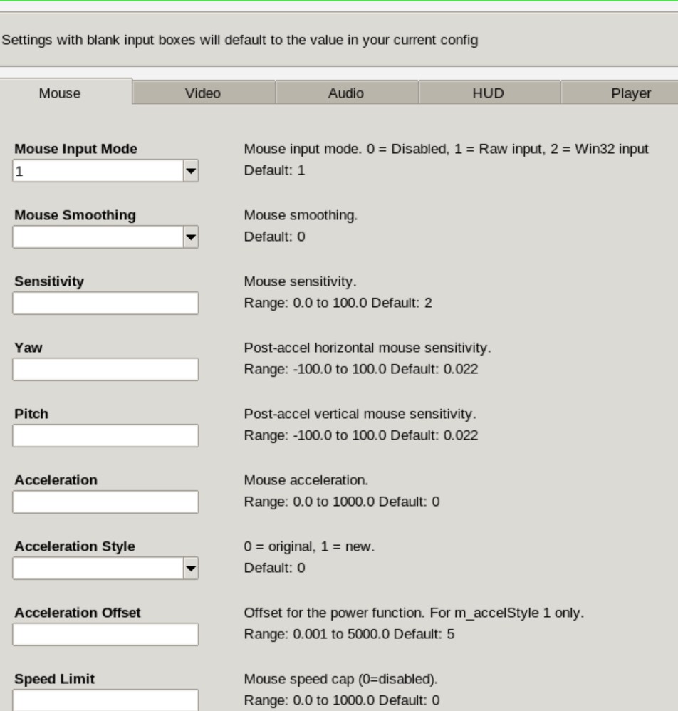

# CPMA Config Tool

A desktop app for configuring **CPMA** (Challenge ProMode Arena) — the competitive mod for **Quake III Arena** — through a clean, tabbed interface instead of hand-editing `.cfg` files.

Point it at your Quake III install (or let it download the game files for you), tweak your settings across mouse, video, audio, HUD, player, weapons, and keybinds, and click **Save**. It writes a valid Quake III config and wires it into the game so your changes load automatically.



## What it does

- **Tabbed settings UI** — over 100 game settings organised into seven categories (Mouse, Video, Audio, HUD, Player, Weapons, Keybinds), each with a plain-language label, description, valid range, and the game's default.
- **Reads your existing config** — on launch it parses your current `gui.cfg` and pre-fills every field, so you edit what you have instead of starting from scratch.
- **Writes valid Quake III output** — settings are saved as proper `seta` / `bind` console commands and hooked into `autoexec.cfg` so the game picks them up on its own.
- **Auto-detects your install** — choose your Quake III Arena folder once and it locates the CPMA subfolder, config files, and game executable for you.
- **One-click game setup** — if you don't already have CPMA installed, the built-in installer downloads a ready-to-play Quake III + CPMA bundle into a folder you choose.
- **Launch the game** — start Quake III directly from the app once everything's configured.
- **Export & relocate** — export your generated config to any folder, or move your installed game files to a new location without losing your settings.

Settings you leave blank keep whatever value is already in your config, so you only change what you mean to.

## Install & run

There's no prebuilt installer yet — the app runs from source.

**Requirements:** Python 3.13+ (with the standard-library `tkinter`) and the `requests` package.

```bash
git clone https://github.com/nathancblack/CPMA-Config-Tool.git
cd CPMA-Config-Tool
pip install -r requirements.txt
python src/logic/main.py
```

On first launch the app asks for your Quake III Arena folder. You can either:

1. **Point it at an existing install** — select the Quake III Arena folder that contains your `cpma` directory, or
2. **Install the game files** — open **Advanced Settings → Install Game Assets** and the app downloads a complete Quake III + CPMA bundle for you.

Then edit your settings and click **Save Config**. To play, click **Launch Game** (once a game executable has been located).

> The downloadable game bundle and the bundled `cnq3` executables are Windows-focused; the configuration tool itself runs anywhere Python and Tkinter do.

## How it works

The code is split into two layers:

- **Logic** (`src/logic/`) — all the file handling and game integration. Nothing here depends on the UI, so it can be tested or reused on its own.
- **UI** (`src/ui/`) — a Tkinter front end that builds itself from the data in the logic layer.

Two design choices do most of the heavy lifting:

- **Data-driven settings.** Every game setting is a plain dictionary entry in `settings.py` describing its label, help text, type, valid range, and default. The UI generates all of its widgets from those definitions — so adding a new setting is a one-entry change, with no UI code to touch.
- **A round-trip config parser.** `config_io.py` reads Quake III `.cfg` files into Python via regex (`cfg_to_dict`) and writes them back out as valid console commands (`dict_to_cfg`). Reading your existing config and re-saving it preserves your real values rather than overwriting them with defaults.

Cross-platform path handling (`paths.py`) keeps the app's saved state in the right per-OS location (`%LOCALAPPDATA%` on Windows, `~/Library/Application Support` on macOS, `~/.local/share` on Linux) and auto-resolves the Quake III folder structure from a single chosen directory.

## Repository structure

```
src/
├── logic/
│   ├── main.py        # Entry point: wires up PathManager + InstallManager, launches the GUI
│   ├── paths.py       # PathManager: persists paths, auto-detects Q3/CPMA folders, launches the game
│   ├── settings.py    # Data-driven definitions of 100+ cvars across 7 categories
│   ├── config_io.py   # Reads/writes Quake III .cfg files (the round-trip parser)
│   └── installer.py   # InstallManager: download / install / move / uninstall the game assets
└── ui/
    └── main_window.py # ConfigApp: builds the tabbed GUI and the Advanced Settings window
```

## Notes & limitations

- **Platforms:** the tool runs on Windows, macOS, and Linux. The downloadable game bundle targets Windows; on other platforms point the app at an existing Quake III install.
- **Requirements:** Python 3.13+, Tkinter (ships with most Python builds), and `requests`.
- **No prebuilt binary** is published yet — run from source as above.
- **No automated tests or linter** are configured; the logic layer is structured to make adding them straightforward.

## Credits

Built for the competitive CPMA community by **Nathan Black** and **Felix McLean**.
